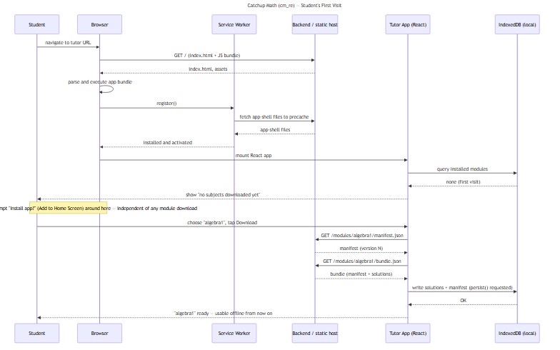

#+TITLE: Catchup Math (cm_re) — App Flow
#+STARTUP: overview

* Summary

High-level flow through the =cm_re= rewrite, end to end: an author
editing a solution, publishing it as part of a subject module, a
student's device syncing that module, and the student working through
it offline with progress synced back later. See [[file:NEW_DIRECTION.org][NEW_DIRECTION.org]]
for the full design discussion/decisions this flow implements, and
[[file:cm_re/README.md][cm_re/README.md]] for the component layout.

* High-level flow

** 1. Authoring & publishing (online only)

An author uses =apps/editor= (TipTap-based, replaces the legacy
=solution_editor=) to create or edit a =Solution= — an ordered list
of steps, each carrying author-controlled HTML. Saving a solution
bumps its =version= and persists it to the backend (Postgres JSONB).
When the author is ready to ship a batch of changes, they trigger a
*publish* for that subject. The backend's =ModulePublisher= gathers
every solution for that =subjectId=, hashes the content, and writes a
new =ModuleManifest= version — the unit students actually sync.

=editor= has no offline mode by design (see NEW_DIRECTION.org's
"Frontend platform" decision) — this whole phase assumes connectivity.

** 2. Module sync (student device, online)

When a student opens =apps/tutor= with connectivity, it fetches the
small =manifest.json= for their subject(s) and compares the version
against what's already installed locally (IndexedDB). If newer, it
fetches the full =bundle.json= (manifest + every solution in that
subject) and writes it into IndexedDB, requesting persistent storage
first so the browser doesn't evict it under storage pressure.

This can also be an explicit "download for offline" action the
student takes before going somewhere without a connection, not just
a passive background check.

** 3. Offline tutoring (student device, no connectivity required)

Once a module is installed, the tutor UI reads solutions and their
steps directly from IndexedDB — no network calls on this path at
all. The student navigates step by step (=SolutionNav=); each step's
author-controlled HTML is sanitized (DOMPurify) and rendered
(=StepViewer=). Every answer submission or step-completion event is
enqueued locally (=offline/syncQueue.ts=), not sent immediately.

** 4. Progress sync (student device, back online)

Once the device reconnects, the queued progress events flush to the
backend in a batch (=POST /api/progress/sync=). This is a
single-writer append, not a merge — one student's own queued events,
no conflict resolution needed.

* Sequence diagrams

Diagrams use Mermaid syntax (mermaid-mode in Emacs) — see CLAUDE.md's
"Diagram format" section.

** Full lifecycle (publish → sync → offline use → progress sync)

Main players: the author (via =editor=), the backend API, and the
student's device (=tutor= PWA + its local IndexedDB). Shows one full
cycle: publish → sync → offline use → progress sync.

#+begin_src mermaid :file app_flow_sequence.png
sequenceDiagram
    title Catchup Math (cm_re) — App Flow

    participant Author
    participant Editor as Editor (apps/editor)
    participant Backend as Backend API
    participant Student
    participant Tutor as Tutor PWA (apps/tutor)
    participant IDB as IndexedDB (local)

    %% --- Authoring & publishing (online) ---
    Author->>Editor: edit solution steps
    Editor->>Backend: PUT /api/solutions/:id
    Backend-->>Editor: 200 OK (version bumped)
    Author->>Editor: publish "algebra1" module
    Editor->>Backend: POST /api/modules/algebra1/publish
    Backend->>Backend: bundle solutions, hash, bump manifest version
    Backend-->>Editor: 200 OK (new module version)

    %% --- Module sync (student device, online) ---
    Student->>Tutor: open app
    Tutor->>Backend: GET /modules/algebra1/manifest.json
    Backend-->>Tutor: manifest (version N)
    Tutor->>IDB: read installed manifest
    IDB-->>Tutor: version N-1 (stale)
    Tutor->>Backend: GET /modules/algebra1/bundle.json
    Backend-->>Tutor: bundle (manifest + solutions)
    Tutor->>IDB: write solutions + manifest (persist() requested)
    IDB-->>Tutor: OK

    %% --- Offline tutoring (no connectivity required) ---
    Note over Student,IDB: device goes offline here — everything below needs no network
    Student->>Tutor: start solution "Solving 2x + 3 = 11"
    Tutor->>IDB: read solution + steps
    IDB-->>Tutor: solution document
    Tutor-->>Student: render step (sanitized HTML)
    Student->>Tutor: submit answer
    Tutor->>Tutor: enqueue progress event (syncQueue)

    %% --- Progress sync (back online) ---
    Note over Student,Backend: connectivity restored
    Tutor->>Backend: POST /api/progress/sync (batched events)
    Backend-->>Tutor: 200 OK
#+end_src

** Student's first visit (empty device — no service worker, no IndexedDB yet)

The "Module sync" phase above assumes a service worker and IndexedDB
already exist. This is the visit before that's true: nothing is
installed, nothing is cached, and the app has to bootstrap itself
before it can offer a module to download.

#+begin_src mermaid :file app_flow_first_visit.png
sequenceDiagram
    title Catchup Math (cm_re) — Student's First Visit

    participant Student
    participant Browser
    participant SW as Service Worker
    participant Backend as Backend / static host
    participant Tutor as Tutor App (React)
    participant IDB as IndexedDB (local)

    %% --- First load: nothing cached, nothing installed ---
    Student->>Browser: navigate to tutor URL
    Browser->>Backend: GET / (index.html + JS bundle)
    Backend-->>Browser: index.html, assets
    Browser->>Browser: parse and execute app bundle

    %% --- Service worker installs for the first time ---
    Browser->>SW: register()
    SW->>Backend: fetch app-shell files to precache
    Backend-->>SW: app-shell files
    SW-->>Browser: installed and activated

    %% --- App boots, finds nothing installed yet ---
    Browser->>Tutor: mount React app
    Tutor->>IDB: query installed modules
    IDB-->>Tutor: none (first visit)
    Tutor-->>Student: show "no subjects downloaded yet"

    %% --- Optional: browser offers to install the PWA itself ---
    Note over Browser,Student: browser may separately prompt "Install app?" (Add to Home Screen) around here — independent of any module download

    %% --- Student picks a subject and downloads its first module ---
    Student->>Tutor: choose "algebra1", tap Download
    Tutor->>Backend: GET /modules/algebra1/manifest.json
    Backend-->>Tutor: manifest (version N)
    Tutor->>Backend: GET /modules/algebra1/bundle.json
    Backend-->>Tutor: bundle (manifest + solutions)
    Tutor->>IDB: write solutions + manifest (persist() requested)
    IDB-->>Tutor: OK
    Tutor-->>Student: "algebra1" ready — usable offline from now on
#+end_src

#+RESULTS:

