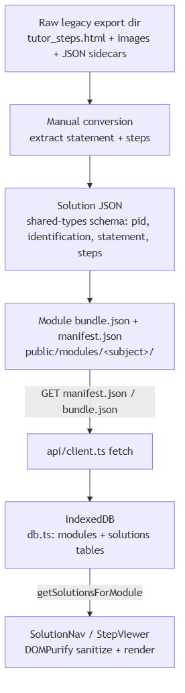

#+TITLE: Catchup Math (cm) — Build Status
#+STARTUP: overview

* Summary

Build works. Root cause of "can't build" was the JDK on PATH, not the project itself.

* Problems

** DONE JDK mismatch — mvn defaults to JDK 23, GWT 2.7.0 can't compile on it
   - Symptom :: ~mvn gwt:compile~ fails with misleading error:
     #+begin_example
     [ERROR] Hint: Check that your module inherits 'com.google.gwt.core.Core'
     either directly or indirectly (most often by inheriting module 'com.google.gwt.user.User')
     #+end_example
   - Root cause :: This is GWT's generic compiler-crash fallback message, not an actual
     module-inheritance problem. GWT 2.7.0 (~2015-era) cannot run its own compiler
     correctly under a modern JDK. Default ~java -version~ on this machine resolves to
     Oracle JDK 23.0.1.
   - Verified fix :: Build with JDK 8, already installed at
     ~C:\java\java-se-8u44-ri~. Confirmed clean ~BUILD SUCCESS~ (~80s, 5 permutations,
     link succeeded) using:
     #+begin_src sh
     export JAVA_HOME="/c/java/java-se-8u44-ri"
     export PATH="$JAVA_HOME/bin:$PATH"
     mvn gwt:compile -Dgwt.module=hotmath.gwt.cm.CatchupMath -Dgwt.compiler.force=true -o
     #+end_src

** DONE Makefile broke when invoked from a plain PowerShell prompt (not Git Bash)
   - Symptom :: ~make build~ from PowerShell (standalone ~make.exe~ at
     ~C:\dev\tools\make.exe~, not part of Git Bash) failed with mvn's
     ~The JAVA_HOME environment variable is not defined correctly~ error, even
     though the exact same recipe worked fine from inside a Git Bash terminal.
   - Root cause :: A plain PowerShell session doesn't have Git Bash's own
     ~/usr/bin~ / ~/mingw64/bin~ at the front of ~PATH~ (those only get
     prepended by Git Bash's profile scripts, which a bare ~make.exe -> bash.exe~
     subprocess never sources). With the raw Windows PATH, ~uname~ resolves to
     *Cygwin's* ~uname.exe~ (also installed on this machine at
     ~C:\cygwin64\bin~) instead of Git's, which prints ~CYGWIN_NT-...~. The
     ~mvn~ launcher script branches on that string and takes the
     ~cygwin=true~ path, which runs ~JAVA_HOME=`cygpath --unix "$JAVA_HOME"`~
     — but the ~cygpath~ that resolves is *also* Cygwin's, and Cygwin's
     ~cygpath~ doesn't understand Git/MSYS-style ~/c/...~ paths (it expects
     ~/cygdrive/c/...~), so it mangles ~JAVA_HOME~ into something that fails
     mvn's own ~[ -x "$JAVA_HOME/bin/java" ]~ check.
   - Verified fix :: Two changes to the ~Makefile~:
     1. Pin ~SHELL~ explicitly so ~make~ always uses Git Bash regardless of
        which terminal invoked it (short 8.3 path needed — a raw path with
        spaces in ~SHELL :=~ silently fails):
        #+begin_src makefile
        SHELL := C:/PROGRA~1/Git/usr/bin/bash.exe
        .SHELLFLAGS := -ec
        #+end_src
     2. Explicitly prepend Git's own ~usr/bin~ and ~mingw64/bin~ to ~PATH~
        inside the recipe, ahead of everything else, so ~uname~/~cygpath~
        resolve to Git's tools and not Cygwin's:
        #+begin_src sh
        PATH="/c/Program Files/Git/usr/bin:/c/Program Files/Git/mingw64/bin:/c/java/java-se-8u44-ri/bin:$PATH" JAVA_HOME=/c/java/java-se-8u44-ri mvn ...
        #+end_src
   - Verified :: ~make build~ run directly from a plain PowerShell prompt
     (not Git Bash) now produces a clean ~BUILD SUCCESS~.
   - ~build.bat~ was unaffected — it's pure ~cmd.exe~ syntax with a
     Windows-style ~JAVA_HOME~, so it never hit the Cygwin/mingw ~uname~
     branch in mvn's script. Re-verified working as-is.

** DONE Makefile / build.bat don't pin JDK 8
   - Both just ran ~mvn gwt:compile ...~ with no ~JAVA_HOME~ override, so they failed
     against the machine's default JDK 23 until the environment was set manually.
   - Two extra gotchas hit along the way, both fixed:
     1. ~Makefile~ had CRLF line endings. GNU Make (mingw32 build) embeds the
        trailing ~\r~ into an exported variable's value, so
        ~JAVA_HOME := /c/java/java-se-8u44-ri~ + ~export JAVA_HOME~ silently became
        ~/c/java/java-se-8u44-ri\r~ — invalid path, ~mvn~'s own ~[ -x "$JAVA_HOME/bin/java" ]~
        check failed with the generic "JAVA_HOME environment variable is not defined
        correctly" message. Fixed by normalizing to LF (~sed -i 's/\r$//'~).
     2. A top-level ~JAVA_HOME := ...~ / ~export JAVA_HOME~ Makefile variable did
        *not* reliably reach the ~mvn~ subprocess even after the CRLF fix (likely a
        mingw32-make env-export quirk interacting with a Windows-level ~JAVA_HOME~
        already set system-wide to JDK 23 — case-insensitive Windows env vars vs.
        make's internal env table). Fixed by setting ~JAVA_HOME~/~PATH~ as an inline
        prefix on the same command line as ~mvn~ instead, e.g.
        ~JAVA_HOME=/c/java/java-se-8u44-ri PATH="...:$PATH" mvn ...~ — same subshell,
        no cross-process handoff, no ambiguity.
   - Verified :: ~make build~ (bash) and ~.\build.bat~ (PowerShell) both produce a
     clean ~BUILD SUCCESS~ from a shell where ~JAVA_HOME~ was *not* pre-set.

** TODO pom.xml repositories are all plain =http://=
   - Maven 3.8+ blocks insecure repos by default (mirror ~maven-default-http-blocker~).
     Build output shows:
     #+begin_example
     [WARNING] Could not transfer metadata ... Blocked mirror for repositories:
     [central (http://repo1.maven.org/maven2/, ...), gson (http://google-gson.googlecode.com/...),
      openqa-releases (http://nexus.openqa.org/...), sourceforge-releases (http://oss.sonatype.org/...),
      projectlombok.org (http://projectlombok.org/mavenrepo, ...),
      gwt-mobile-webkit (http://gwt-mobile-webkit.googlecode.com/svn/repo, ...)]
     #+end_example
   - Not currently failing the build because every needed artifact is already cached
     in the local ~.m2~ repo.
   - Risk :: any *new* dependency added to the project will fail to resolve until
     these repos are fixed.
   - Fix :: switch each repo URL to =https://=, and drop the dead ones outright
     (Google Code shut down in 2016 — the ~gson~ and ~gwt-mobile-webkit~ repos are
     gone; the ~projectlombok.org/mavenrepo~ legacy repo is also long dead).

** TODO Uncommitted local edits to pom.xml need review
   - ~maven-compiler-plugin~ source/target bumped ~1.7~ → ~1.8~
   - New dependency added, replacing a commented-out block:
     #+begin_src xml
     <dependency>
         <groupId>gwt-html5-storage</groupId>
         <artifactId>gwt-html5-storage</artifactId>
         <version>1.0.1</version>
     </dependency>
     #+end_src
     Previously commented-out version used groupId
     ~com.google.code.gwt-mobile-webkit~. The new groupId looks hand-edited /
     suspicious. There's also an untracked ~libs/gwt-html5-storage-1.0.1.tar.gz~,
     suggesting the intent was to use a local jar rather than pull from a repo.
     *Confirm this actually resolves to the right artifact* rather than silently
     falling back to something stale in the local cache.
   - ~gwt.compiler~ ~logLevel~: ~ERROR~ → ~INFO~
   - ~maven-antrun-plugin~ block (post-compile version-info update) commented out
     entirely — confirm this was intentional and not a debugging leftover.

** TODO Untracked working tree is large and messy
   - Many ~??~ entries in ~git status~: build outputs, extracted vendor assets, old
     zips, ~security/2020~–~2023~ dirs, etc.
   - Fix :: pass on ~.gitignore~; either commit what belongs in version control or
     ignore generated/vendor artifacts so ~git status~ stays legible.

* Solution content pipeline (cm_re rewrite)

Where a solution's content actually goes, raw export to rendered
tutor step — reflects what's built and verified in =cm_re/= so far
(see =NEW_DIRECTION.org= for the full decisions log; this is just the
picture). Diagram uses Mermaid (mermaid-mode), not wsd — see
CLAUDE.md's "Diagram format" section.

#+begin_src mermaid :file solution_pipeline.png
flowchart TD
    A["Raw legacy export dir tutor_steps.html + images + JSON sidecars"] --> B["Manual conversion extract statement + steps"]
    B --> C["Solution JSON shared-types schema: pid, identification, statement, steps"]
    C --> D["Module bundle.json + manifest.json public/modules/&lt;subject&gt;/"]
    D -->|"GET manifest.json / bundle.json"| E["api/client.ts fetch"]
    E --> F["IndexedDB db.ts: modules + solutions tables"]
    F -->|"getSolutionsForModule"| G["SolutionNav / StepViewer DOMPurify sanitize + render"]
#+end_src

#+RESULTS:

- *Q: does the purify happen for the entire module at once? Or, is it on
  view of solution. The latter is better, it might run out of memory/cpu
  otherwise.*
  *ANSWERED (2026-08-30): per-view, already.* The only
  =DOMPurify.sanitize()= call sites are =StepViewer= and =QuestionView=,
  both at render time inside =dangerouslySetInnerHTML=. =SolutionNav=
  renders the statement + the question + *only* =steps[stepIndex]= — not
  all steps — so it's lazy even within one solution. The
  download/IndexedDB-write path (=moduleManager.downloadModule= →
  =db.ts=) does *zero* sanitization; it stores raw published HTML for all
  846 solutions untouched. Nothing ever sanitizes a whole module in one
  pass. No memory/CPU cliff.

* Next steps

- [ ] Decide: commit ~pom.xml~ changes as-is, or roll back the speculative
      ~gwt-html5-storage~ dependency swap
- [X] Pin JDK 8 in ~Makefile~ / ~build.bat~
- [ ] Convert pom repo URLs to =https://=, drop dead repos
- [ ] Add/clean up ~.gitignore~, sort out untracked file sprawl
- [ ] Commit ~Makefile~/~build.bat~ JDK-8 pin (currently uncommitted local changes)
